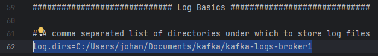
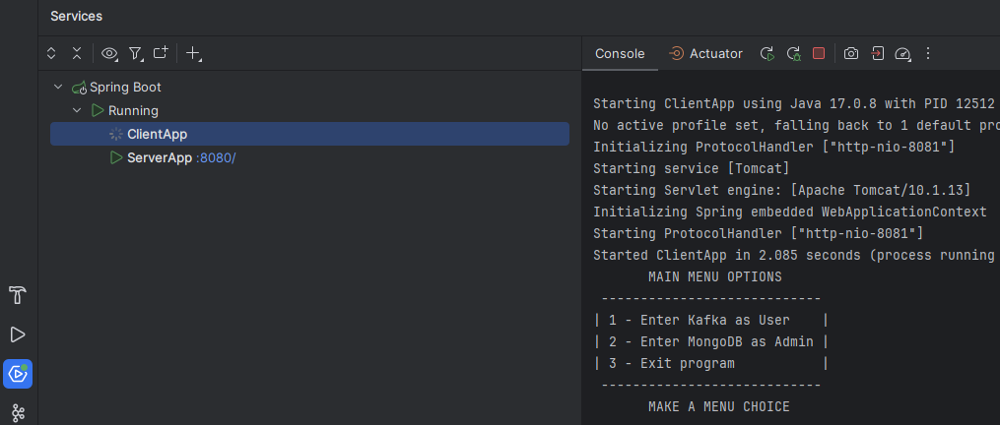

## **Johan's Disturbance Reporter**

---
### Description
My motivation for creating this application was due to the fact that I think the time it takes to file a disturbance report, if your neighbours are making too much noise, is too long.  
With minimal effort, the user is able to file a report and send it to the landlord (MongoAdmin), who's then able to view the report and take immediate action thanks to a MongoDB API.
 Integrating Apache Kafka in this application, the report is directly sent to the landlords database, preventing middlemen to interfere and causing delays in the process.
 I learned a great deal about the importance of integrating Apache Kafka in applications, not only to improve the user experience, but more importantly, to improve the application's efficiency.

---
### Table of Contents
+ [Installation](#installation)
+ [Usage](#usage)
+ [Troubleshooting](#troubleshooting)
+ [Credits](#credits)
+ [Dependencies](#dependencies)
+ [License](#license)
+ [Link to Documentation](Installation&Documentation/Documentation.md)
+ [Tests](#tests)

---
### Installation
*Before you run the application, do the following:*
+ Make sure you have an IDE installed, such as [IntelliJ IDEA](https://www.jetbrains.com/idea/download/#section=windows) and [JDK 17](https://www.oracle.com/se/java/technologies/downloads/#java17).
+ [Apache Kafka](https://www.apache.org/dyn/closer.cgi?path=/kafka/3.5.0/kafka_2.13-3.5.0.tgz) - Download the latest version of Apache Kafka and extract the files to a directory of your choice.
+ [MongoDB Community Server](https://www.mongodb.com/try/download/community) - Download the latest version of MongoDB and install it. Make sure to install the MongoDB Compass as well, when asked by the installation wizard.
+ Clone this GitHub repository to your computer.
+ This application uses 3 separate Kafka Brokers. To set this up, do the following:
    + Head over to your Apache Kafka directory's config folder and make 3 copies of "server.properties" and rename them to "server1.properties", "server2.properties" and "server3.properties", or whatever you prefer.
    + After you've done that, head over to [broker-config](Installation&Documentation/broker-config) and copy-paste the content from broker1, broker2 and broker3 to each broker you just created. Be sure that you are not specifying my personal directory, but your own, inside each broker.properties-file on line 62, as shown here:
       
---
### Usage (For Windows)
*To run the application, do the following:*
+ Open the directory where you extracted the Apache Kafka files and run the following commands in the terminal:
    + (ZooKeeper) - `.\bin\windows\zookeeper-server-start.bat .\config\zookeeper.properties`
    + (Broker) - `.\bin\windows\kafka-server-start.bat .\config\server.properties` (Repeat this command for each broker you created previously)
+ Open your MongoDB Compass and click on the green "Connect" button. This will connect you to your localhost MongoDB.
+ Open this project in your IntelliJ IDEA and head over to the "Services"-tab located in the bottom-left corner. You should see the following:
   
+ Either right-click on Spring Boot and click on "Run" or manually run the following applications in the following order:
    + ServerApp
    + ClientApp
+ Wait a few seconds for the ServerApp-service to start, and later you can begin using the menu in the ClientApp-service

---
### Troubleshooting
Sometimes, things go wrong for whatever reason. The most common of reasons, that I've experienced are the following:
+ **Maven related problems:**
    + Make sure you have the correct JDK installed. This application uses JDK 17.
    + Reload the Maven project by right-clicking on the project and click on "Maven" -> "Reload Project".
    + Or reload each module separately by right-clicking on each module and click on "Maven" -> "Reload Project".
+ **Apache Kafka related problems:**
    + Make sure you've followed the [Installation](#installation) guide correctly.
    + Make sure you've started the ZooKeeper and each Broker correctly.
    + In your directory where you extracted the Apache Kafka files, delete the "logs"-folders. This will reset the logs and might solve your problem.
+ **MongoDB related problems:**
    + Make sure you've followed the [Installation](#installation) guide correctly.
    + Make sure you've started the MongoDB Community Server correctly.
    + Make sure you've started the MongoDB Compass correctly.
    + Make sure you've connected to your localhost MongoDB correctly.
---
### Credits
+ [ChatGPT 3.5](https://chat.openai.com/) - For answering my questions when brain fog was present. For documenting the code.
+ [Emil Sivertsson](https://github.com/Emilsivertsson) - For being a supportive colleague and helping me with unclear questions regarding POST-requests, Module hassles, @Annotations and reviewing the application.
+ [Kristoffer Larsson](https://github.com/KoffaRn) - For being a supportive colleague and helping me with unclear questions regarding Module hassles, (de)serialization, and reviewing the application.

---
### Dependencies
+ [client-side module's pom.xml](client-side/pom.xml)
+ [server-side module's pom.xml](server-side/pom.xml)
+ [shared-pojos module's pom.xml](shared-pojos/pom.xml)

---
### License
[Apache License 2.0](LICENSE)

---
### Tests
In order to run tests, head over to these classes and click on the green arrow at top left corner to run all tests:
+ [KafkaTests](client-side/src/test/com/johan/client/KafkaTests.java)
+ [MongoConsumerTest](server-side/src/test/com/johan/server/kafka/mongo/consumer/MongoConsumerTest.java)
 
